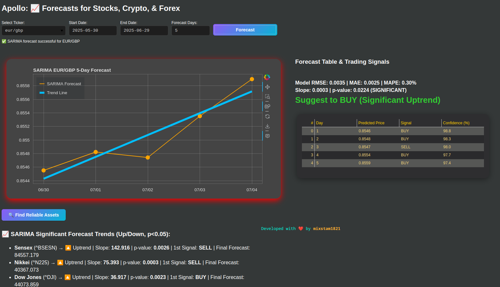

# Apollo: Forecasts for Stocks, Crypto, & Forex

Apollo is an interactive web app (built with Bokeh & yfinance) for forecasting and scanning market trends across equities, ETFs, indices, commodities, forex, and crypto using robust SARIMAX models.



## 🛠️ Requirements

- Python 3.8+
- [bokeh](https://docs.bokeh.org/en/latest/)
- [yfinance](https://github.com/ranaroussi/yfinance)
- pandas, numpy, scipy, statsmodels, scikit-learn

## 📦 Installation

Clone or download the code, then install the requirements:

```bash
pip install -r requirements.txt
bokeh serve --show apollo.py
```

OR

```bash
git clone https://github.com/mixstam1821/Apollo
cd Apollo
docker build -t apollo-forecast-app .
docker run -p 9651:9651 apollo-forecast-app
```
📌 Disclaimer
- This project is for educational and research use only.
No part of this code is financial advice or a trading recommendation.
Do your own due diligence!
